Redmine - пример кадрового управления
=====================================
Попробуем решить с помощью системы отслеживания задач Redmine две кадровые задачи.

1. __Подбор персонала__. Процесс рассмотрения кандидатов на несколько вакансий включает в себя различные цепочки этапов собеседований. На каждом этапе есть сотрудники с определенной компетенцией, которые будут проводить свою часть собеседования. От отдела персонала требуется отчет - сколько кандидатов приглашено, рассмотрено и какие узкие места в подборе возникают.

2. __Учет графика работы сотрудников__. Требуется планирование отпусков сотрудников, учет больничных и прогулов работы, сбор объяснительных и календарно-плановых записок.

Подбор персонала
----------------
*Сначала зададим виды вакансий и различные цепочки этапов собеседования.*

Для этого нам необходим режим администратора, в который мы попадем, если поставим соответствующую галочку "является администратором" в настройках пользователя из меню "Администрирование > Пользователи".

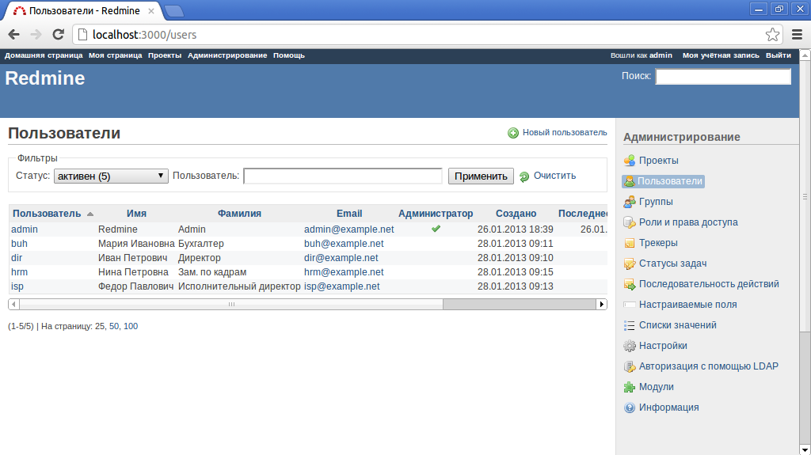
Рис.1. Меню "Администрирование > Пользователи"

Теперь нам доступно меню "Администрирование > Трекеры", где можно определить виды задач и привязать к каждому виду набор статусов и возможность выборочного переключения статусов для определенных ролей пользователей. Для каждого вида вакансии добавим по новой записи в списке трекеров. Например, "Соискатель секретарь", "Соискатель водитель" и "Соискатель бухгалтер". Название "соискатель" вместо слова "вакансия" мы выбрали не случайно. Представьте, как будет выглядеть список задач с текстом "вакансия Петров И.И.", более привычно звучит - "соискатель Петров И.И.".

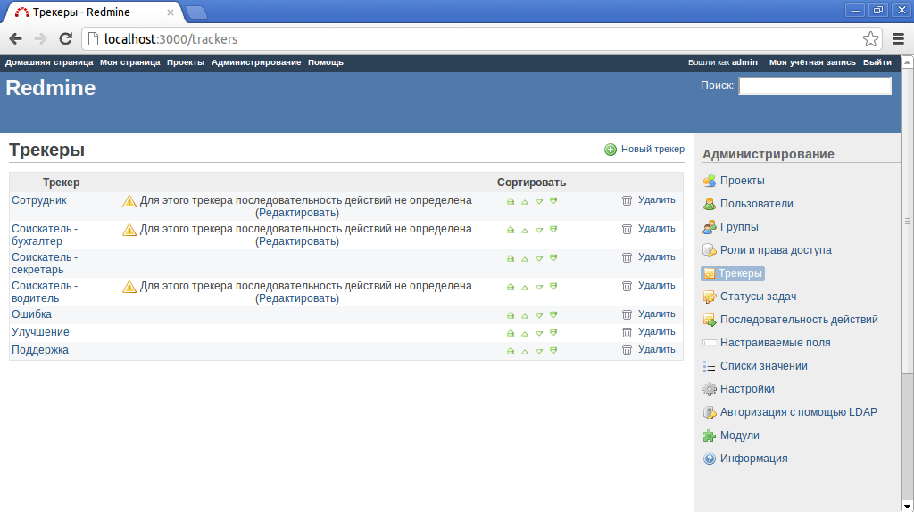
Рис.2. Меню "Администрирование > Трекеры"

В списке статусов в меню "Администрирование - Статусы задач" добавим все возможные этапы собеседований в нашей компании - "Новый соискатель", "Заполнение анкеты", "Тест на делопроизводство", "Тест на вождение", "Тест по бухучету", "Начальник", "Принят на работу", "Отказ", "Архив". В Redmine уже есть несколько заранее определенных статусов для задач - "Новая", "В работе", "Решена", "Обратная связь", "Закрыта", "Отклонена". Некоторым статусам можно присвоить признак "Задача закрыта", при достижении такого статуса задача помечается завершенной и выделяется зачеркнутым написанием. Отметим таким признаком последние три статуса для автоматического завершения кадровой задачи по рассмотрению соискателя.

Рис.3. Меню "Администрирование > Статусы задач"

Заведенные статусы пока никак не привязаны к нашим трекерам. Для привязки на необходимо в меню "Администрирование > Последовательность действий" добавить матрицу возможных переходов от статуса к статусу для каждой пары "роль пользователя - трекер". Предварительно добавим необходимые роли в меню "Администрирование > Роли и права доступа" - "Руководитель", "Экономист", "Офис менеджер", "Сотрудник". При настроенной матрице переходов каждый пользователь с назначенной соответствующей ролью в проекте сможет со "своего" статуса переключить задачу только на разрешенный ему набор соответствующих статусов.

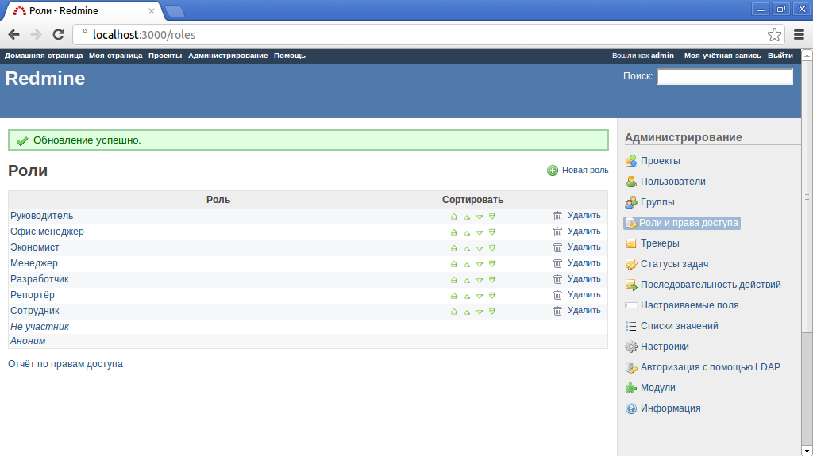
Рис.4. Меню "Администрирование > Роли и права доступа"

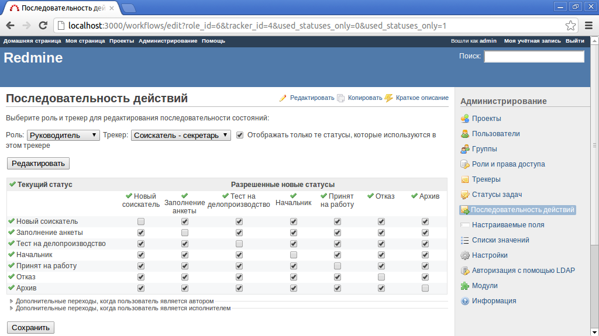
Рис.5. Меню "Администрирование > Последовательность действий"

Теперь у нас есть необходимые настройки для заведения в систему соискателей.

*Попробуем завести несколько соискателей.*

Будем кадровое дело для каждого соискателя определять как задачу, а тип вакансии задавать через поле в задаче - трекер. Но сначала нам необходимо завести проект через меню "Администрирование > Проекты". Назовем проект "Кадровое управление".

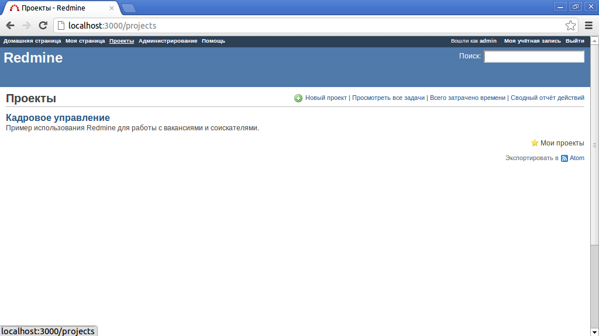
Рис.6. Меню "Проекты"

После заведения ряда соискателей в списке задач мы получим базу кадровых дел, через которые сможем понимать, какое количество в единицу времени кандидатов поступает и отслеживать процесс проведения собеседований через смену статусов задач и назначенного на этап собеседования сотрудника. Для повышения эффективности работы с кадровой базой в списке задач мы можем настраивать фильтры для различных этапов или видов вакансий.

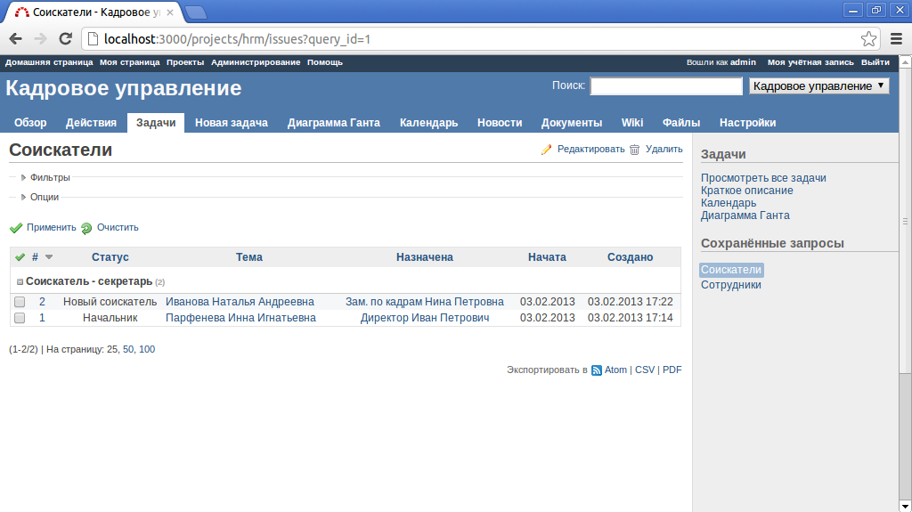
Рис.7. Меню "Проект - Кадровое управление > Задачи"

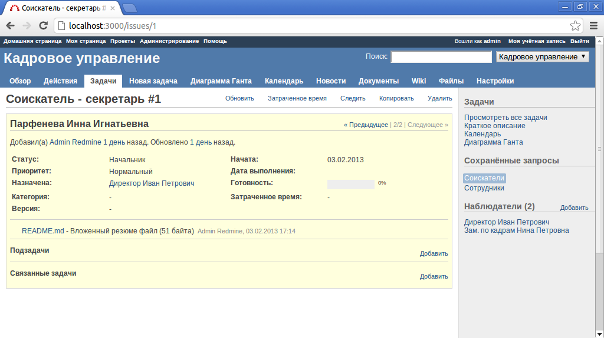
Рис.8. Меню "Проект - Кадровое управление > Соискатель"

Ответим на вопрос - сколько кандидатов обработано и сколько нам предстоит рассмотреть.

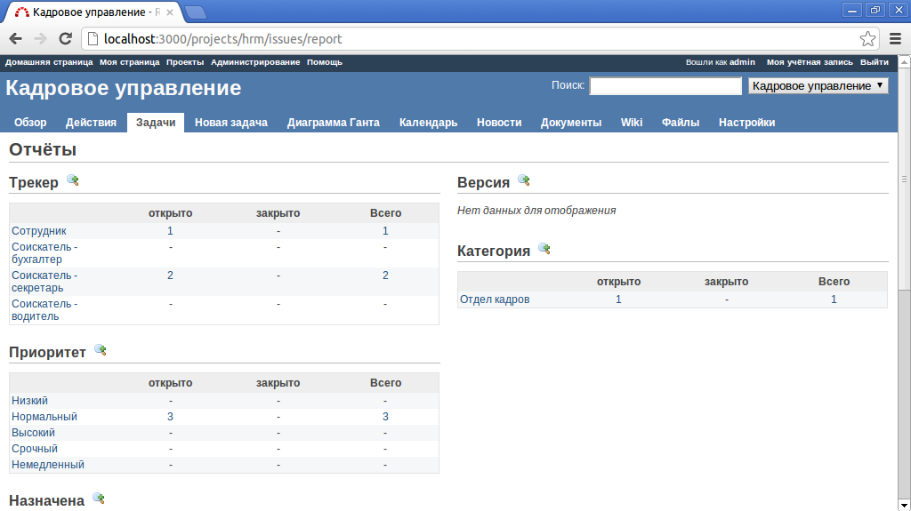
Рис.9. Меню "Проект - Кадровое управление > Отчет"

Учет графика работы сотрудников
-------------------------------
Для кадровых дел действующих сотрудников заведем отдельный трекер "Сотрудник" и добавим для него новые статусы. Также определим последовательность действий над сотрудникам.

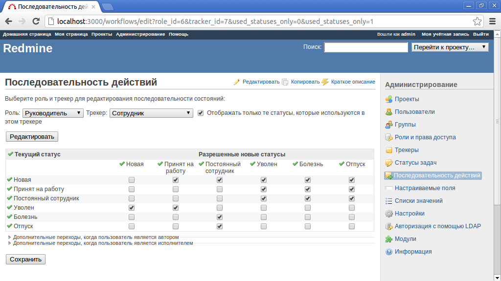
Рис.10. Меню "Проект - Кадровое управление > Последовательность действий для сотрудников"

Теперь будем отправлять сотрудников в отпуск созданием связанной задачи с наименованием имени сотрудника. Можно использовать и подчиненные задачи, но в таком случае родительская задача превратится в группу задач с расчетом начала и окончания от подчиненных подзадач. А нам хотелось бы использовать поля задачи "начало" и "окончание" для учета принятия сотрудников на работу и их увольнения.

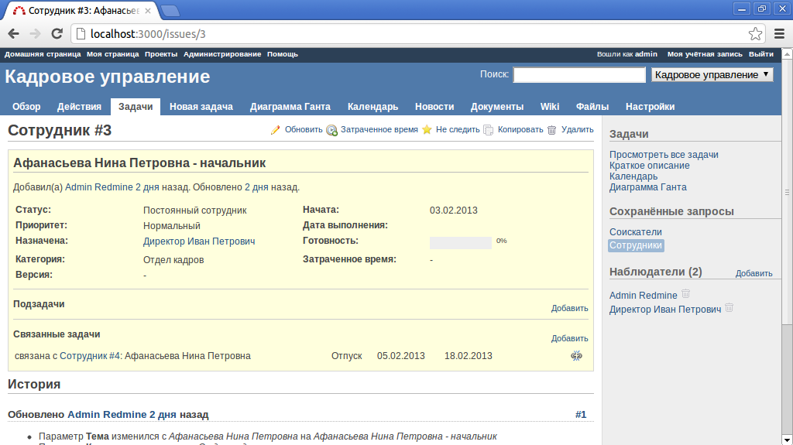
Рис.11. Меню "Проект - Кадровое управление > Карточка сотрудника"

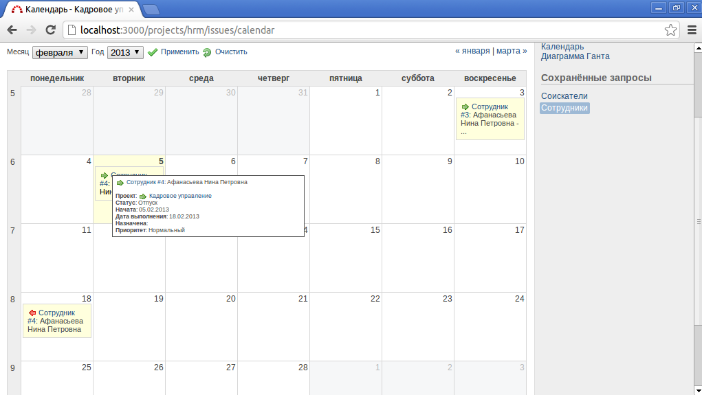
Рис.12. Меню "Проект - Кадровое управление > Календарь отпусков"

Аналогичным способом можно добавлять и больничные. И в этой статье продемонстрирован один из способов организации процесса кадрового управления с использованием метода отслеживания задач и программы Redmine, которая предусматривает большой набор инструментов и настроек для задач, пользователей, механизмов отслеживания, пользовательских полей для специфичных параметров и много другое.
