Redmine - пример управления компьютерным парком офиса предприятия
=================================================================
Попробуем решить с помощью системы отслеживания задач Redmine две задачи по управлению компьютерным парком среднего офиса.

1. __Планирование закупок и ремонта компьютерного оборудования__. Процесс эксплуатации компьютерного парка включает в себя различные цепочки этапов планирования закупок и технологического обслуживания. Для каждого этапа есть ответственные сотрудники, которые Принимают решения по эксплуатации и проводят технологические работы. От отдела администрирования требуется отчет - сколько компьютерной техники запланировано приобрести в ближайшее время, какое количество работ по эксплуатации ведется в данный момент.

2. __Обеспечение непрерывной работы компьютеров сотрудников__. Требуется обеспечение бесперебойной работы сотрудников с компьютерной техникой, учет обращений сотрудников с техническими проблемами, сбор и контроль записок с потребностями сотрудников в компьютерах.

Планирование закупок и ремонта компьютерного оборудования
---------------------------------------------------------
*Сначала зададим виды компьютерного оборудования и различные эксплуатационные цепочки его закупки и обслуживания.*

Для этого нам необходим доступ уровня администратора, которым обладают пользователи с отметкой "является администратором" в меню "Администрирование > Пользователи".

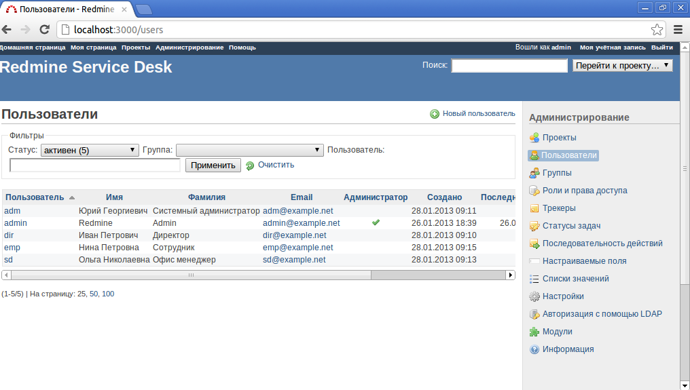
Рис.1. Меню "Администрирование > Пользователи"

Теперь нам доступно меню "Администрирование > Трекеры". С помощью трекеров можно определить цепочки этапов и правила проведения эксплуатационных работ. Для каждого вида компьютерного оборудования добавим по новой записи в списке трекеров. Например, "Офисный компьютер", "Принтер" и "Расходный материал".

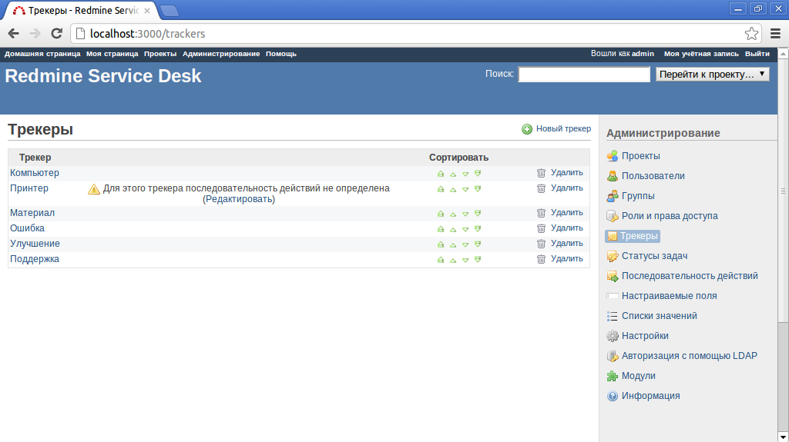
Рис.2. Меню "Администрирование > Трекеры"

В списке статусов в меню "Администрирование - Статусы задач" добавим все возможные этапы эксплуатации компьютерного парка - "Планирование", "Закупка", "Установка", "Эксплуатация", "Модернизация", "Обслуживание", "Списание", "Отказ", "Архив". В Redmine уже есть несколько заранее определенных статусов для задач - "Новая", "В работе", "Решена", "Обратная связь", "Закрыта", "Отклонена". Некоторым статусам можно присвоить признак "Задача закрыта", при достижении такого статуса задача помечается завершенной и выделяется зачеркнутым написанием. Отметим таким признаком последние три статуса для автоматического завершения задач по эксплуатации.

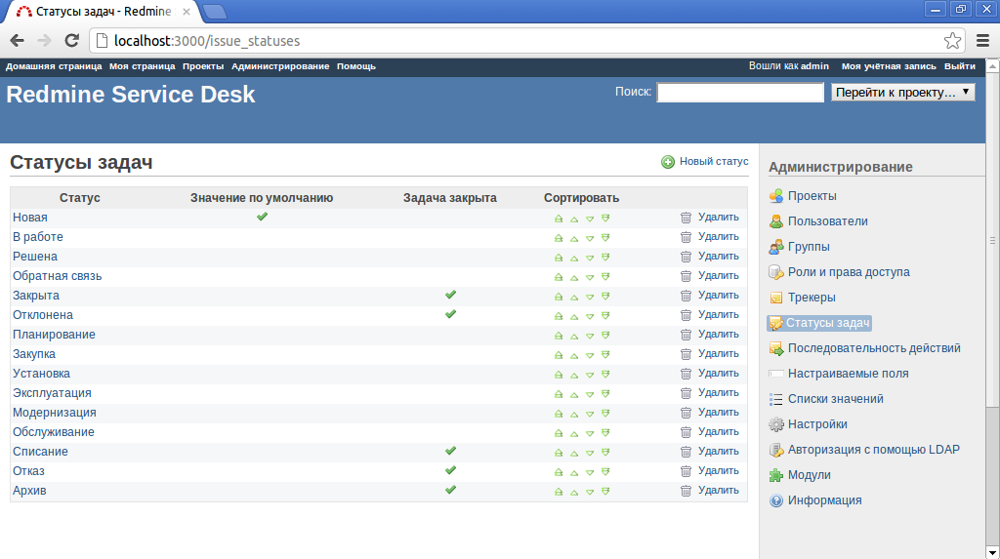
Рис.3. Меню "Администрирование > Статусы задач"

Заведенные статусы пока никак не привязаны к нашим трекерам. Для привязки нам необходимо в меню "Администрирование > Последовательность действий" добавить матрицу возможных переходов от статуса к статусу для каждой пары "роль пользователя - трекер". Предварительно добавим необходимые роли в меню "Администрирование > Роли и права доступа" - "Руководитель", "Системный администратор", "Офис менеджер", "Сотрудник". При настроенной матрице переходов каждый пользователь с назначенной соответствующей ролью в проекте сможет со "своего" статуса переключить задачу только на разрешенный ему набор соответствующих статусов.

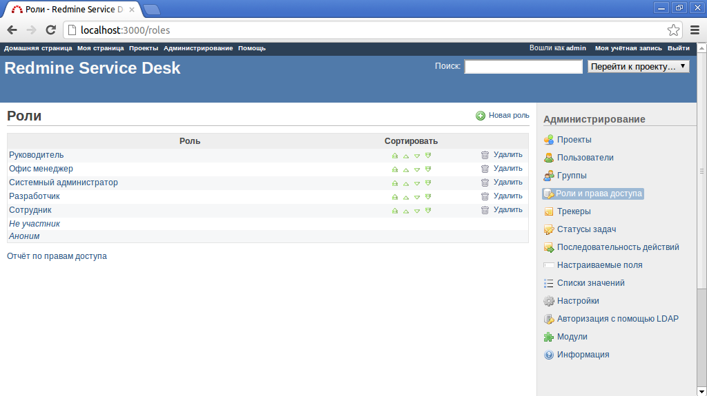
Рис.4. Меню "Администрирование > Роли и права доступа"

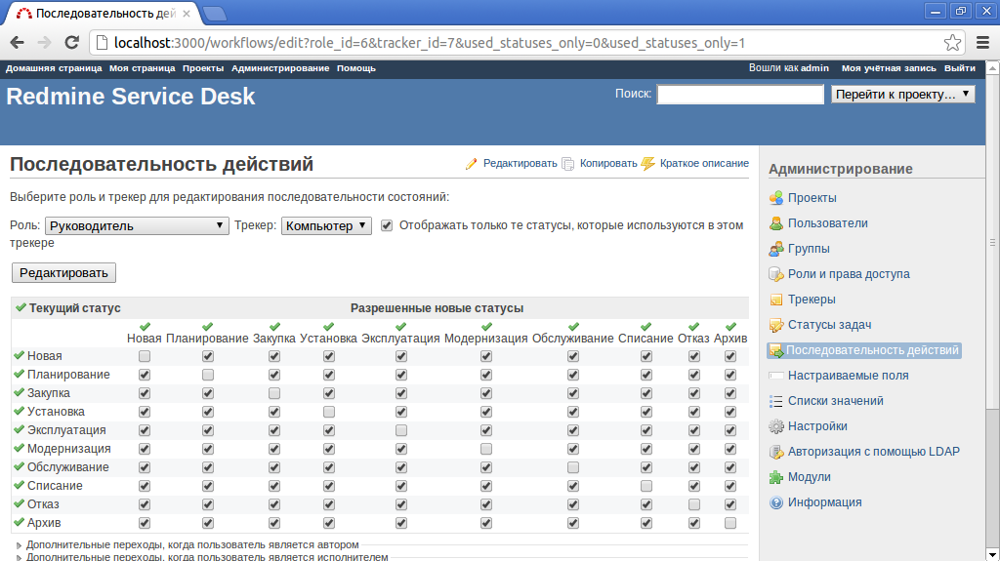
Рис.5. Меню "Администрирование > Последовательность действий"

Теперь у нас есть необходимые настройки для заведения в систему компьютерного парка.

*Попробуем завести несколько компьютеров и принтеров.*

Будем инвентарную запись для каждой единицы оборудования определять как задачу, а тип оборудования задавать через поле в задаче - трекер. Но сначала нам необходимо завести проект через меню "Администрирование > Проекты". Назовем проект "Компьютерный парк".

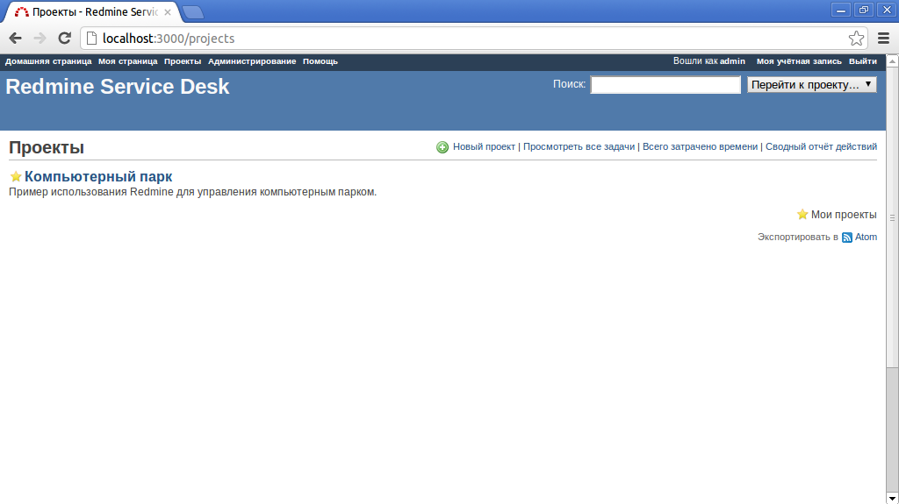
Рис.6. Меню "Проекты"

После заведения компьютеров и принтеров в списке задач мы получим инвентарную базу, через которую сможем понимать, сколько и какого типа компьютерного оборудования мы планируем купить, а также отслеживать процесс эксплуатации через смену статусов задач и назначенного на этап собеседования сотрудника. Для повышения эффективности работы с инвентарной базой в списке задач мы можем настраивать фильтры для различных состояний или видов оборудования.

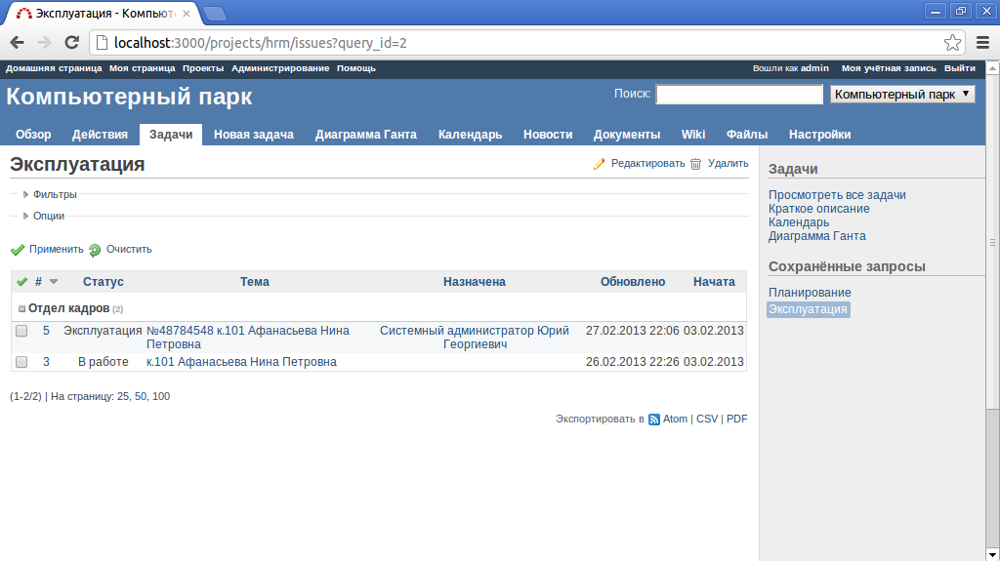
Рис.7. Меню "Проект - Компьютерный парк > Задачи"

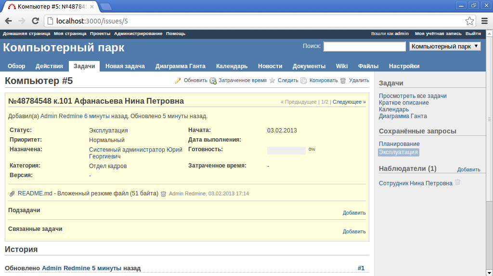
Рис.8. Меню "Проект - Компьютерный парк > Оборудование"

Ответим на вопрос - сколько и какие компьютеры сейчас эксплуатируются и сколько принтеров предстоит купить.

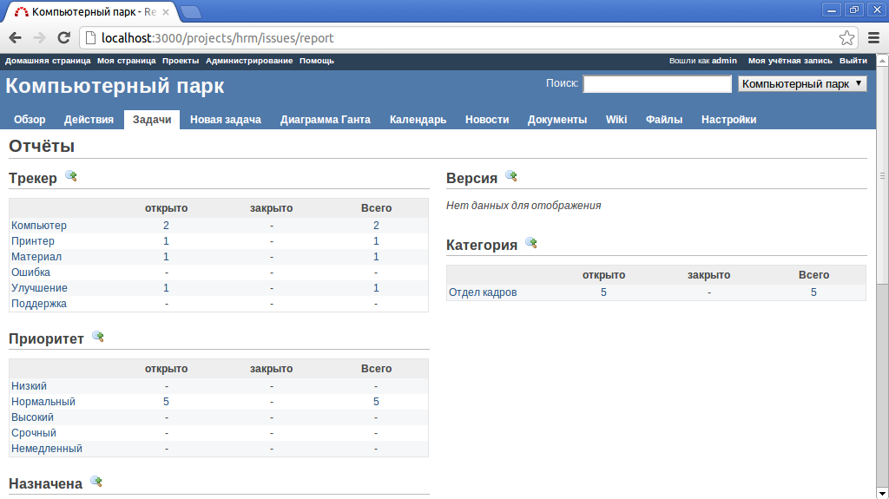
Рис.9. Меню "Проект - Компьютерный парк > Отчет"

Обеспечение непрерывной работы компьютеров сотрудников
------------------------------------------------------
Для приема заявок на обслуживание от сотрудников будем использовать уже существующий трекер "Ошибка" и добавим для него новые статусы. Также определим последовательность действий по заявкам сотрудников.

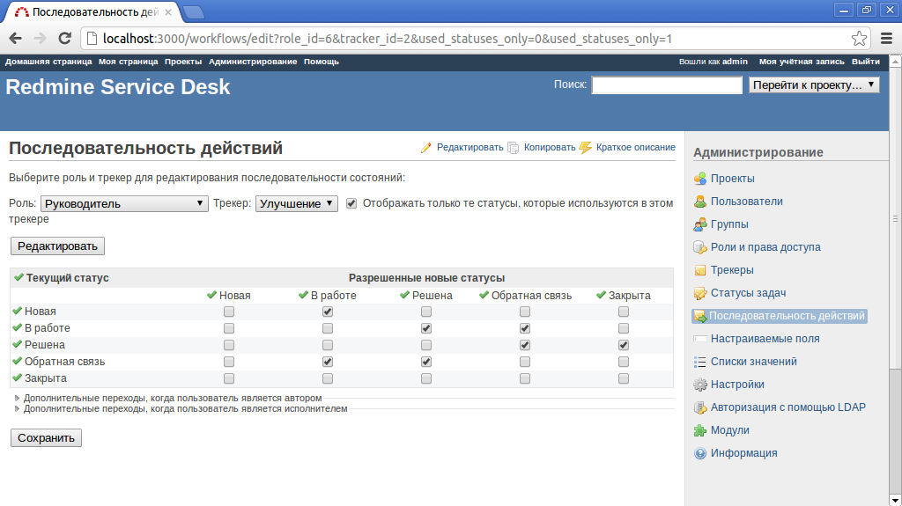
Рис.10. Меню "Проект - Компьютерный парк > Последовательность действий для заявок на обслуживание"

Теперь будем вести учет жалоб сотрудников в отделе системного администрирования с помощью связанных задач с указанием проблемы в наименовании задачи. Можно использовать и подчиненные задачи, но в таком случае родительская задача превратится в группу задач с расчетом начала и окончания от подчиненных подзадач. А нам хотелось бы использовать поля задачи "начало" и "окончание" для учета принятия оборудования в эксплуатацию и его списания.

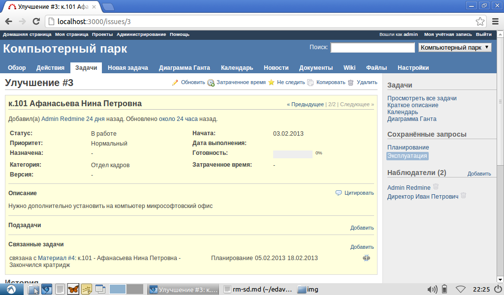
Рис.11. Меню "Проект - Компьютерный парк > Карточка инцидента"

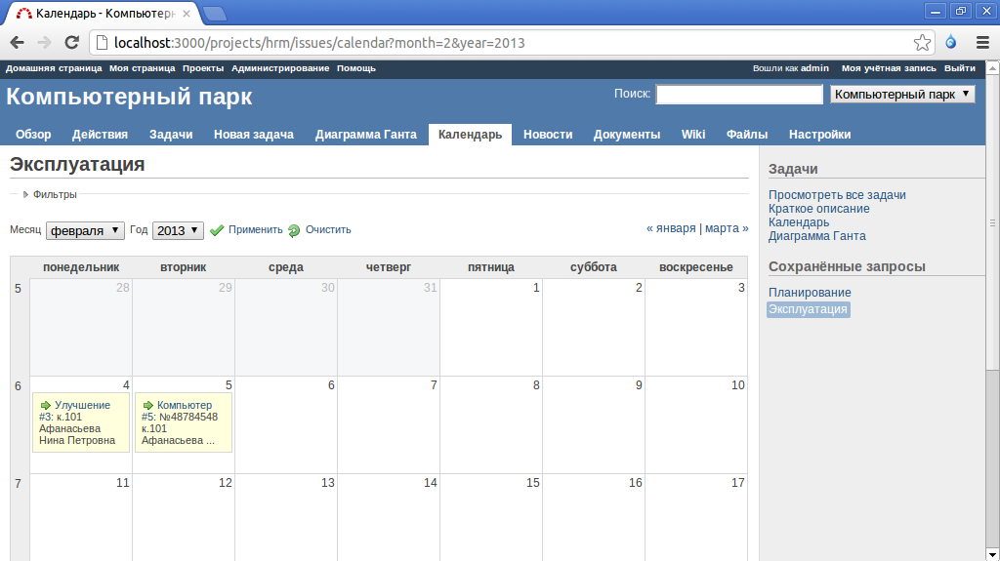
Рис.12. Меню "Проект - Компьютерный парк > График обслуживания"

Аналогичным способом в программную конфигурацию Redmine можно добавлять учет по ремонту оборудования и прочим видам эксплуатационных работ.
